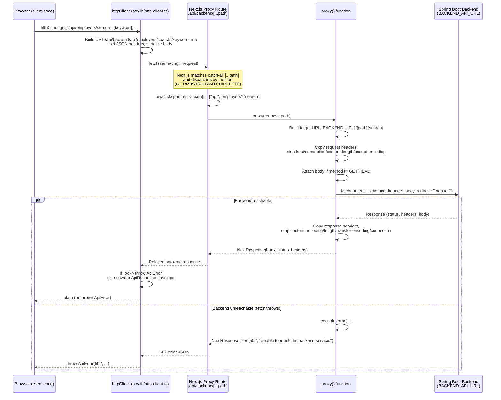

# Backend API Proxy

How the CenterPort frontend talks to the Spring Boot backend.

## TL;DR

The browser **never** calls the backend directly. Every backend request goes to a
same-origin Next.js Route Handler at `/api/backend/[...path]`, which forwards it
to the real backend server-side. The backend host lives only in a server-only
environment variable (`BACKEND_API_URL`) and is never exposed to client code.

```
Browser  ──►  /api/backend/...  (Next.js server)  ──►  BACKEND_API_URL/...
         ◄──                                       ◄──
```

## Why a proxy?

- **Hides the backend host.** The real backend URL stays server-side. The browser
  only ever sees the same-origin path `/api/backend`.
- **Single choke point.** One place to add cross-cutting concerns later (auth
  headers, logging, rate limiting) without touching every call site.
- **No CORS.** Because requests are same-origin (`/api/backend`), the browser does
  not need CORS preflights to reach the backend.
- **One source of truth for config.** The backend location is set once via
  `BACKEND_API_URL`.

## The pieces

| File | Role |
| --- | --- |
| `src/app/api/backend/[...path]/route.ts` | The proxy Route Handler. Forwards requests to the backend. |
| `src/lib/http-client.ts` | Client-side HTTP wrapper. All app code calls the backend through this. |
| `src/lib/photo.ts` | Fetches backend-served assets (photos) through the same proxy path. |
| `.env.local` | Defines `BACKEND_API_URL` (server-only). |

## Path mapping

The segments captured after `/api/backend/` are forwarded verbatim, preserving the
path, query string, request body, and HTTP method.

| Browser request | Forwarded to backend |
| --- | --- |
| `GET /api/backend/api/employers/search?keyword=ma` | `GET {BACKEND_API_URL}/api/employers/search?keyword=ma` |
| `POST /api/backend/api/profiles` | `POST {BACKEND_API_URL}/api/profiles` |

Note the `api` appears twice in the browser URL: `/api/backend` is the proxy mount
point, and `/api/...` is the backend's own route prefix.

## Configuration

Set in `frontend/.env.local`:

```
BACKEND_API_URL=http://127.0.0.1:8080
```

- `BACKEND_API_URL` is **server-only** (no `NEXT_PUBLIC_` prefix), so it is never
  bundled into client-side JavaScript.
- It is the single source of truth. If unset, the proxy uses the sentinel
  `INVALID_BACKEND_API_URL`, which makes misconfiguration fail loudly rather than
  silently pointing somewhere unexpected.

## Request flow



## The proxy handler in detail

`src/app/api/backend/[...path]/route.ts`

- **Catch-all routing.** `[...path]` is a Next.js catch-all dynamic segment, so any
  depth of path under `/api/backend/...` is captured into a `path` array.
- **Supported methods.** Exports `GET`, `POST`, `PUT`, `PATCH`, and `DELETE`, each
  delegating to a shared `proxy()` function.
- **Header hygiene.** Strips host-specific / hop-by-hop request headers before
  forwarding (`host`, `connection`, `content-length`, `accept-encoding`) and drops
  response headers Next.js recomputes (`content-encoding`, `content-length`,
  `transfer-encoding`, `connection`).
- **Body handling.** Forwards the raw request body as an `ArrayBuffer` for any method
  other than `GET`/`HEAD`.
- **Redirects.** Uses `redirect: "manual"` so backend redirects are relayed, not
  auto-followed by the proxy.
- **Errors.** If the upstream `fetch` throws (backend down/unreachable), returns a
  `502` with `{ success: false, message: "Unable to reach the backend service." }`.

## The client wrapper

`src/lib/http-client.ts` exposes `httpClient`, the single entry point app code uses.

- `httpClient.get / post / put / delete` — send JSON, then **unwrap the backend
  `ApiResponse<T>` envelope** and return just the `data` field.
- `httpClient.uploadFile(path, file)` — posts `multipart/form-data` (lets the browser
  set the boundary; no JSON content-type).
- `httpClient.downloadPdf(path, filename?)` — fetches a binary file and opens it in a
  new tab, falling back to a download if the popup is blocked.

Paths passed to `httpClient` are backend paths (e.g. `/api/employers/search`); the
client prepends the `/api/backend` proxy prefix automatically via its `BASE_URL`.

### Error handling

- Non-OK responses are parsed by `parseErrorResponse` and thrown as an `ApiError`
  carrying `status`, `message`, and any field-level `violations`.
- Error messages are read defensively from either `detail` or `message`, and
  violations from either a flat `violations` array or the RFC 9457
  `properties.violations` location.

### Example usage

```ts
import { httpClient, ApiError } from "@/lib/http-client";

try {
  // GET /api/backend/api/employers/search?keyword=ma
  const results = await httpClient.get<Employer[]>("/api/employers/search", {
    keyword: "ma",
  });

  // POST /api/backend/api/profiles
  const created = await httpClient.post<Profile>("/api/profiles", newProfile);
} catch (err) {
  if (err instanceof ApiError) {
    console.error(err.status, err.message, err.violations);
  }
}
```

## Known limitations and gotchas

- **Methods.** Only `GET`, `POST`, `PUT`, `PATCH`, and `DELETE` are exported. `HEAD`
  and `OPTIONS` are not proxied. In practice same-origin calls don't trigger CORS
  preflight (`OPTIONS`), so this is normally fine.
- **Buffering, not streaming.** Both request and response bodies are read fully into
  memory (`arrayBuffer`). This is fine for typical JSON APIs and PDFs, but large
  file streaming or Server-Sent Events would buffer rather than stream.
- **No auth injection yet.** The proxy is currently a transparent pass-through (aside
  from error logging). It's the intended place to add auth headers/logging later.

## Adding a new backend call

You usually don't touch the proxy. Just call `httpClient` with the backend path:

```ts
const data = await httpClient.get<MyType>("/api/my-new-endpoint", { page: 1 });
```

The proxy already forwards any path under `/api/backend/...`, so new endpoints work
without changes to `route.ts`.
